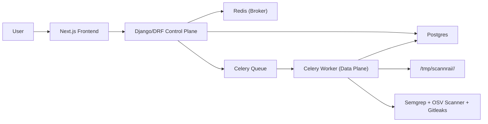

# ScannrAI

ScannrAI is an AI Code Reviewer & Security Scanner with a control-plane/data-plane architecture.

## Core Architecture



- Control plane: accepts requests, validates sources, enqueues scans, serves findings/exports/policy.
- Data plane: performs ingestion + scanner execution only in worker runtime.
- API never runs scanner processes directly.

## Feature Summary
- Option B language-agnostic scanners:
  - Semgrep (SAST)
  - OSV Scanner (dependency vulnerabilities)
  - Gitleaks (secrets)
- Secure ingestion:
  - remote git URL (shallow clone depth=1)
  - local git path
  - local zip path and uploaded zip (`zip_file`) with zip-slip + size/file-count enforcement
- Normalized findings schema with dedupe fingerprints
- Per-user policy (`/api/policy`) for tool enablement, thresholds, per-tool timeouts, retention
- Audit logging for queue/start/complete/fail + export downloads + policy updates
- Export endpoints (`export.json`, `export.md`)
- Optional AI enrichment endpoints (toggle with `AI_FEATURE_ENABLED`)

## Normalized Finding Model
Each finding persists:
- `tool`, `severity`, `category`, `title`, `description`
- `file_path`, `line_start`, `line_end`
- `references` JSON
- `fingerprint` (stable hash)
- `raw` JSON (sanitized/redacted)
- optional AI fields (`ai_explanation`, `ai_fix_suggestion`, `ai_patch_diff`, `confidence`)

## Security/Hardening Highlights
- Strict subprocess execution (`shell=False`), per-tool timeouts
- Runner resource limits (memory + CPU time)
- Truncated stdout/stderr capture to avoid unbounded logs
- Secret redaction in persisted raw payloads and API responses
- IP-level middleware throttle for scan creation + per-user/hour scan rate limit
- Workspace cleanup with retention policy
- Crash-safe Celery delivery (`acks_late` + `reject_on_worker_lost`) with Redis visibility timeout
- Stale-running scan recovery watchdog to fail orphaned `running` scans safely
- Structured scan logging with `scan_correlation_id`

## API Endpoints
- `POST /api/projects`
- `GET /api/projects`
- `POST /api/projects/{id}/scans`
  - JSON body for path/url-based scans
  - `multipart/form-data` with `zip_file` for uploaded zip scans
- `GET /api/scans/{id}`
- `GET /api/scans/{id}/findings?severity=&tool=&category=&file=`
- `GET /api/findings/{id}`
- `GET /api/scans/{id}/export.json`
- `GET /api/scans/{id}/export.md`
- `GET /api/policy`
- `PUT /api/policy`
- `POST /api/auth/change-password`

## Local Setup

### Prerequisites
- Docker Desktop (or Docker Engine + Compose plugin)
- Node.js 22+ (optional for local frontend-only commands)
- Python 3.12+ (optional for local backend tests)

### 1) Configure env
```bash
cp env.template .env
```

Important vars:
- `POSTGRES_*`, `REDIS_HOST_PORT`
- `CORS_ALLOWED_ORIGINS`, `NEXT_PUBLIC_API_BASE_URL`
- `SCAN_TOOL_TIMEOUT_SECONDS`, `SCAN_TOOL_MEMORY_LIMIT_MB`, `SCAN_TOOL_CPU_TIME_SECONDS`
- `SCAN_ZIP_MAX_BYTES`, `SCAN_ZIP_MAX_FILES`
- `SCAN_SHARED_UPLOAD_DIR` (backend/worker shared path for uploaded zip ingestion)
- `SCAN_RETENTION_SECONDS`, `SCAN_RATE_LIMIT_PER_HOUR`, `SCAN_CREATE_IP_RATE_LIMIT_PER_MINUTE`
- `SCAN_STALE_RUNNING_TIMEOUT_SECONDS`
- `LOCAL_REPO_MOUNT_PATH` (default `/host/home`)
- `AI_FEATURE_ENABLED` (`1` enabled, `0` disabled)
- Celery delivery hardening:
  - `CELERY_TASK_ACKS_LATE`
  - `CELERY_TASK_REJECT_ON_WORKER_LOST`
  - `CELERY_WORKER_PREFETCH_MULTIPLIER`
  - `CELERY_BROKER_VISIBILITY_TIMEOUT`

### 2) Start stack
```bash
docker compose up --build
```

Services:
- `postgres`
- `redis`
- `backend`
- `worker`
- `scanner`
- `frontend`

### 3) Access
- Frontend: [http://localhost:3000](http://localhost:3000)
- API root: [http://localhost:8000/api/](http://localhost:8000/api/)
- Health: [http://localhost:8000/api/health/](http://localhost:8000/api/health/)

## Development Commands
- Start detached: `docker compose up -d --build`
- Stop: `docker compose down`
- Logs: `docker compose logs -f backend worker frontend`
- Run migrations: `docker compose exec backend python manage.py migrate`
- Recover orphaned running scans manually: `docker compose exec backend python manage.py recover_stale_scans`
- Backend tests: `USE_SQLITE=1 /Users/ralphvincent/.pyenv/versions/3.12.11/bin/python3 backend/manage.py test`
- Frontend checks: `cd frontend && npm run lint && npm run build`
- Docker cleanup: `make docker-clean`

## Deploy (AWS Lightsail)
- Production runbook: [`docs/deploy/lightsail.md`](docs/deploy/lightsail.md)
- Production compose overlay: `docker-compose.lightsail.yml`
- Bootstrap VM: `./infra/scripts/lightsail-vm-bootstrap.sh`
- Deploy/update on VM: `./infra/scripts/lightsail-deploy.sh`

## Local Source Path Notes
- Local scans are path-based by default; zip upload is available via scan-create API.
- Paths must be container-visible under `${LOCAL_REPO_MOUNT_PATH}`.
- Example host path `/Users/<you>/projects/repo` becomes `/host/home/projects/repo`.

## Runtime Verification (latest)
Validated with live API smoke checks:
- create project
- queue scan on public repo
- queue scan from uploaded zip (`zip_file`)
- scan completes
- export endpoints return data
- secret redaction confirmed on finding raw payloads

## Operational Notes
- If Docker runtime storage is exhausted and Postgres fails with `No space left on device`, run `make docker-clean`.
- If the error persists, run `./infra/scripts/docker-clean.sh --with-builders` to remove non-default buildx builder state volumes.
- Incident logs are tracked under `docs/error-logs/`.
