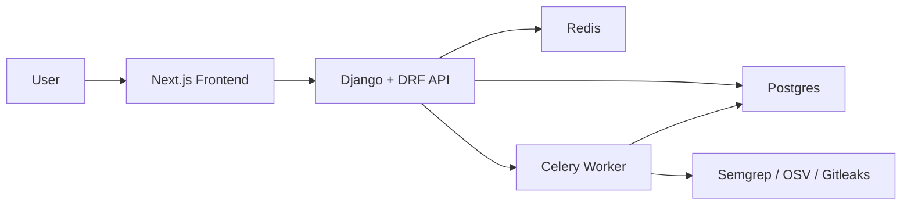
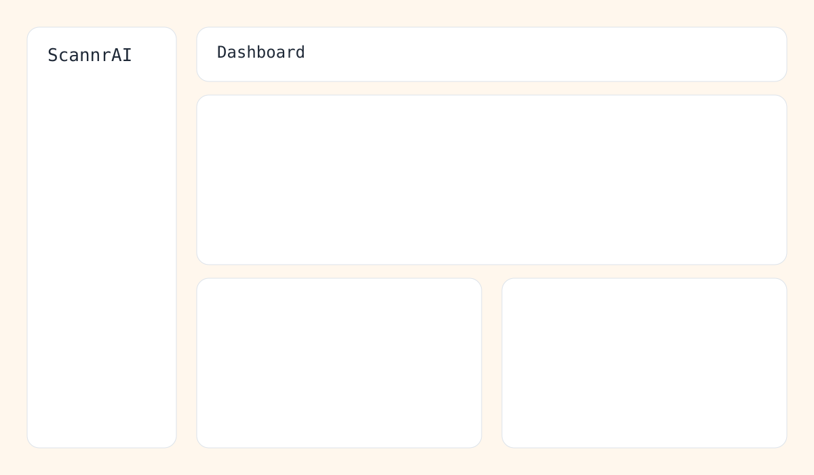
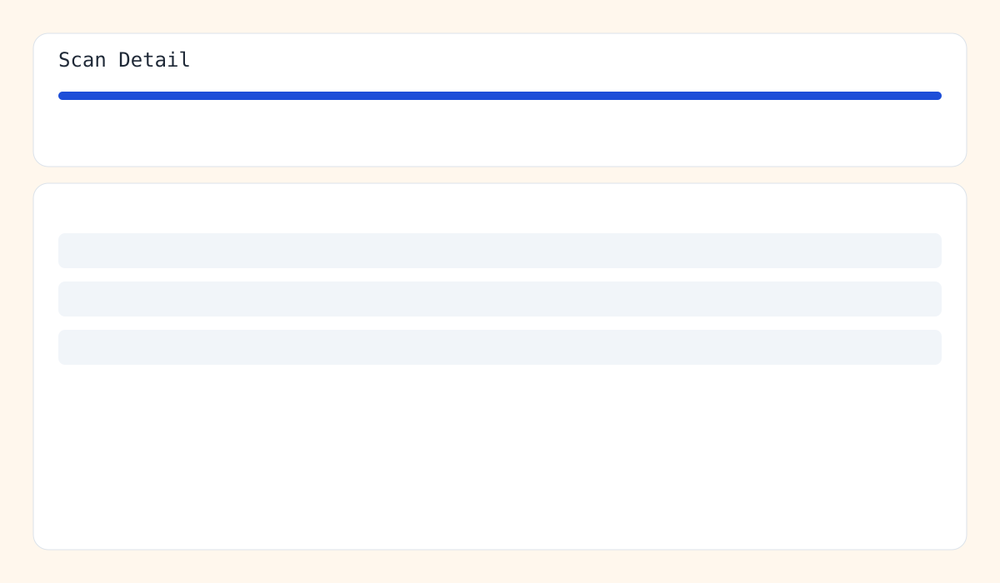

# ScannrAI

ScannrAI is an AI-assisted code security scanner built with Django, DRF, Celery, Redis, Postgres, and Next.js.

## Features
- Project management with authenticated users
- Scan ingestion from Git URL or ZIP upload
- Tool execution pipeline for Semgrep, OSV Scanner, and Gitleaks
- Normalized and deduped findings across tools
- Findings filters, detail drawer, code snippet view, and raw payload view
- AI endpoints for scan summary, finding explanation, and patch scaffolding
- Export endpoints (JSON and Markdown)
- Scan hardening: rate limits, timeout controls, retention policy, and audit logs

## Architecture

## Tech Stack
- Backend: Django, DRF, SimpleJWT, Celery
- Frontend: Next.js App Router, TypeScript, Tailwind, shadcn-style UI
- Infra: Docker Compose, Postgres, Redis
- Scanners: Semgrep, OSV Scanner, Gitleaks

## Repo Structure
- `backend/` Django API + worker logic
- `frontend/` Next.js application
- `infra/` Dockerfiles and startup scripts
- `markdowns/` MVP plan and progress tracker
- `seed/` Demo repository and sample scan exports
- `docs/screenshots/` UI reference images

## Setup and Run

### Prerequisites
- Docker Desktop (or Docker Engine + Compose plugin)
- Node.js `22+` and npm `10+` (optional, only needed for running frontend outside Docker)
- Python `3.12+` (optional, only needed for backend tests outside Docker)

### 1) Configure Environment
1. Copy the example environment file:
   - `cp .env.example .env`
2. Review and adjust values if needed:
   - `DJANGO_SECRET_KEY`
   - `POSTGRES_*`
   - `NEXT_PUBLIC_API_BASE_URL`
   - `SCAN_*` settings (timeouts, retention, rate limits)

### 2) Start the Full App (Docker)
1. Build and run all services:
   - `docker compose up --build`
2. Services started by Compose:
   - `postgres`
   - `redis`
   - `backend` (Django API)
   - `worker` (Celery)
   - `scanner` (tooling image)
   - `frontend` (Next.js)

### 3) Access the App
- Frontend UI: [http://localhost:3000](http://localhost:3000)
- Backend API root (via routes): [http://localhost:8000/api/](http://localhost:8000/api/)
- Health endpoint: [http://localhost:8000/api/health/](http://localhost:8000/api/health/)

### 4) First Use
1. Open `/register` in the frontend and create an account.
2. Sign in at `/login`.
3. Create a project in the dashboard.
4. Run a scan (use repo URL or upload a ZIP).
5. Review findings and export JSON/Markdown from the scan page.

## Development Commands
- Start in background:
  - `docker compose up -d --build`
- Stop services:
  - `docker compose down`
- View logs:
  - `docker compose logs -f backend worker frontend`
- Rebuild one service:
  - `docker compose build backend`
- Run backend tests:
  - `USE_SQLITE=1 /Users/ralphvincent/.pyenv/versions/3.12.11/bin/python3 backend/manage.py test`
- Frontend lint/build:
  - `cd frontend && npm run lint && npm run build`

## Screenshots
- Dashboard: 
- Scan page: 

## Demo Assets
- Seed repo to scan: `seed/demo-repo/`
- Sample scan export JSON: `seed/sample-results/sample-scan-export.json`
- Sample scan report Markdown: `seed/sample-results/sample-scan-report.md`

## Notes
- Docker daemon must be running for full compose startup.
- If local `git` is unavailable on macOS, scan ingestion falls back to Dulwich clone logic.
- Build/runtime troubleshooting entries are tracked in `docs/error-logs/`.
