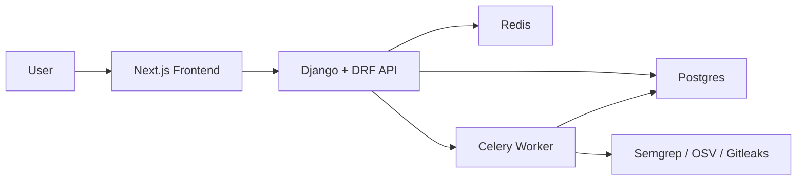

# ScannrAI

ScannrAI is an AI-assisted code security scanner built with Django, DRF, Celery, Redis, Postgres, and Next.js.

## Features
- Project management with authenticated users
- Scan ingestion from Git URL or ZIP upload
- Tool execution pipeline for Semgrep, OSV Scanner, and Gitleaks
- Normalized and deduped findings across tools
- Findings filters, detail drawer, code snippet view, and raw payload view
- AI endpoints for scan summary, finding explanation, and patch scaffolding
- Export endpoints (JSON and Markdown)
- Scan hardening: rate limits, timeout controls, retention policy, and audit logs

## Architecture

## Tech Stack
- Backend: Django, DRF, SimpleJWT, Celery
- Frontend: Next.js App Router, TypeScript, Tailwind, shadcn-style UI
- Infra: Docker Compose, Postgres, Redis
- Scanners: Semgrep, OSV Scanner, Gitleaks

## Repo Structure
- `backend/` Django API + worker logic
- `frontend/` Next.js application
- `infra/` Dockerfiles and startup scripts
- `markdowns/` MVP plan and progress tracker
- `seed/` Demo repository and sample scan exports
- `docs/screenshots/` UI reference images

## Local Setup
1. Copy env values:
   - `cp .env.example .env`
2. Start services:
   - `docker compose up --build`
3. API health check:
   - `GET http://localhost:8000/api/health/`
4. Frontend:
   - `http://localhost:3000`

## Useful Commands
- Backend tests:
  - `USE_SQLITE=1 /Users/ralphvincent/.pyenv/versions/3.12.11/bin/python3 backend/manage.py test`
- Frontend lint/build:
  - `cd frontend && npm run lint && npm run build`

## Screenshots
- Dashboard: 
- Scan page: 

## Demo Assets
- Seed repo to scan: `seed/demo-repo/`
- Sample scan export JSON: `seed/sample-results/sample-scan-export.json`
- Sample scan report Markdown: `seed/sample-results/sample-scan-report.md`

## Notes
- Docker daemon must be running for full compose startup.
- If local `git` is unavailable on macOS, scan ingestion falls back to Dulwich clone logic.
